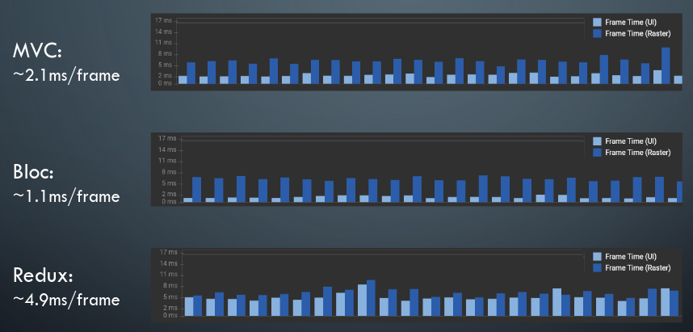
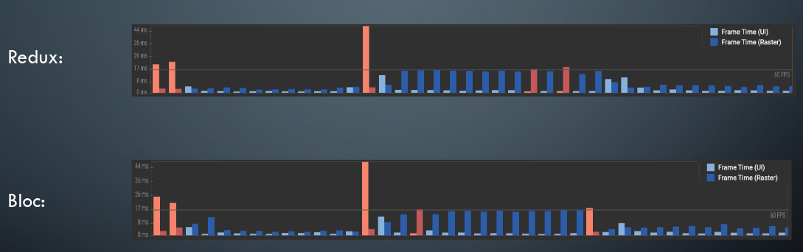

# The State of State Management

## **Running the examples**

* In the `statemanagement` directory run the command `flutter run`
* Toggle the different examples and frameworks by selecting the desired option in `lib/main.dart`

## **Results**

### Example 1

 

### Example 2

 

